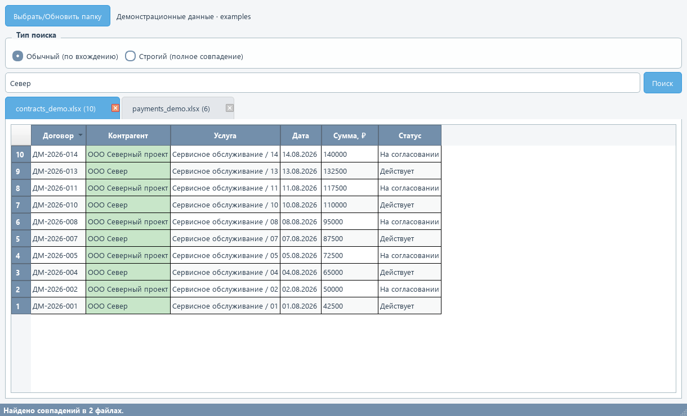

<p align="center"></p>

<p align="center"><strong>Одна папка. Несколько таблиц. Один поиск.</strong><br>Настольное приложение для поиска информации в Excel без ручного открытия каждого файла.</p>

<p align="center"><a href="#быстрый-старт">Быстрый старт</a> · <a href="#демонстрация">Демонстрация</a> · <a href="#как-устроено">Как устроено</a> · <a href="#ограничения">Ограничения</a></p>

---

## Задача

Договоры, контрагенты и другие рабочие данные часто распределены по нескольким Excel-файлам. Femida загружает таблицы из выбранной папки, ищет совпадения и показывает найденные строки в отдельных вкладках.

Проект создан для автоматизации рабочей задачи и использовался коллегами и заказчиками. Разработка велась с помощью ИИ-ассистента. В репозитории опубликована настольная версия на Python и PyQt6.

## Возможности

| Возможность | Что делает приложение |
| --- | --- |
| Поиск по папке | Читает `.xlsx` и `.xls` из выбранной директории |
| Два режима | Поиск по вхождению и по полному совпадению без учёта регистра |
| Результаты по файлам | Показывает совпавшие строки в отдельных вкладках |
| Подсветка и фильтрация | Выделяет совпадения; двойной щелчок по заголовку столбца открывает фильтр |
| Фоновая обработка | Чтение файлов и поиск выполняются в `QThread` |
| Кэширование | Сохраняет прочитанные таблицы в локальные `.pkl`-файлы |
| Подготовка данных | Убирает полностью пустые строки и столбцы без заголовков; форматирует даты при поиске |
| Последняя папка | Запоминает выбранную директорию между запусками |

## Демонстрация



На скриншоте — интерфейс приложения с синтетическими данными из [`examples/`](examples/). Реальных договоров, клиентов и внутренних документов в примерах нет.

1. Запустите приложение и нажмите **«Выбрать/Обновить папку»**.
2. Выберите папку `examples` в репозитории.
3. Дождитесь окончания загрузки и введите `Север`.
4. Нажмите **«Поиск»**: приложение покажет совпадения в таблицах договоров и платежей.
5. Попробуйте строгий поиск `ООО Север` или двойной щелчок по заголовку **«Статус»** для фильтрации результатов.

## Быстрый старт

**Целевая среда текущей версии: Windows, Python 3.12.** Приложению нужен графический рабочий стол. Это локальная утилита, веб-сервера и базы данных для запуска не требуется.

```powershell
git clone https://github.com/tarnished000/femida.git
cd femida
py -3.12 -m venv .venv
.\.venv\Scripts\python.exe -m pip install -r requirements.txt
.\.venv\Scripts\python.exe Femida.py
```

Активация окружения не требуется: команды используют Python из `.venv` напрямую.

Если репозиторий скачан ZIP-архивом, распакуйте его, откройте PowerShell в папке с `Femida.py` и начните с создания `.venv`.

### Формат таблиц

- Первая строка используется как заголовки столбцов.
- Читается **первый лист** каждого файла.
- Вложенные папки не сканируются.
- Временные файлы Excel с префиксом `~$` пропускаются.
- Файлы должны иметь расширение `.xlsx` или `.xls` в нижнем регистре.
- Для отображения новой редакции таблиц повторно выберите или обновите папку.

## Как устроено


**Чтение.** `openpyxl` обрабатывает `.xlsx`, `xlrd` — `.xls`. Данные хранятся в памяти как pandas DataFrame.

**Поиск.** Обработчик проверяет столбцы и возвращает строки, где совпала хотя бы одна ячейка. При строгом поиске пустой запрос используется для поиска пустых ячеек.

**Интерфейс.** Результаты отображаются через `QTableView`, `QStandardItemModel` и `QSortFilterProxyModel`. Чтение и поиск вынесены в рабочий поток; создание таблиц интерфейса выполняется в основном потоке.

**Кэш.** Текущая версия сравнивает время изменения исходного файла со временем кэша. Подробности и ограничения приведены ниже.

## Стек

`Python` · `PyQt6` · `pandas` · `NumPy` · `openpyxl` · `xlrd`

## Структура репозитория

```text
femida/
├── Femida.py                 # Приложение и оформление интерфейса
├── requirements.txt          # Версии прямых зависимостей
├── examples/                 # Синтетические Excel-файлы для знакомства
│   ├── contracts_demo.xlsx
│   ├── payments_demo.xlsx
│   └── README.md
├── docs/
│   ├── TROUBLESHOOTING.md    # Запуск, ошибки и ограничения
│   └── assets/              # Баннер и скриншот интерфейса
└── README.md
```

## Ограничения

- **Windows-путь к кэшу.** Сейчас кэш сохраняется в `C:\excel_cache_app`. У пользователя должны быть права записи в эту папку. Перенос кэша в пользовательский каталог — отдельная задача развития.
- **Совпадающие имена файлов.** Ключ кэша зависит от преобразованного имени файла без расширения, а не от полного пути. Одинаковые имена в разных папках и некоторые похожие имена могут приводить к использованию чужого кэша. До исправления используйте уникальные имена или очищайте кэш при смене набора таблиц.
- **Спецсимволы в запросах.** Обычный поиск использует регулярные выражения pandas. Символы вроде `.`, `+` и `[` могут менять смысл запроса или вызвать ошибку. Для точного значения используйте строгий режим.
- **Большие таблицы.** Все прочитанные данные находятся в оперативной памяти; большие результаты могут замедлять построение интерфейса. Предельный объём и скорость не измерялись.
- **Локальные данные.** В опубликованном коде нет отправки таблиц на сервер. Кэш содержит копии данных; не подменяйте его чужими `.pkl`-файлами. Pickle предназначен только для доверенных данных.

Список не означает, что приложение проверено для любых рабочих нагрузок. Используйте копии документов при знакомстве с программой.

## Развитие

Это запланированные улучшения, а не уже реализованные функции:

- [ ] Перенести кэш в каталог данных пользователя и устранить коллизии имён.
- [ ] Сделать обычный поиск буквальным, без неявных регулярных выражений.
- [ ] Вынести обработку таблиц из интерфейса и добавить автоматические проверки.
- [ ] Заменить отладочные `print` на настраиваемое логирование.
- [ ] Добавить автоматическую проверку проекта и сборку приложения.

## Обратная связь

Для сообщения об ошибке создайте [issue](https://github.com/tarnished000/femida/issues): укажите версию Python, текст ошибки и шаги воспроизведения. Прикладывайте только обезличенный минимальный пример таблицы.

Автор: [Амир Лапшин / tarnished000](https://github.com/tarnished000).
